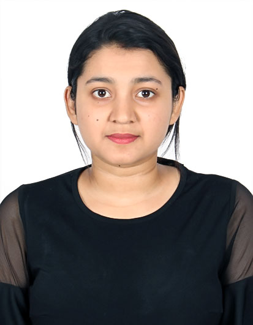
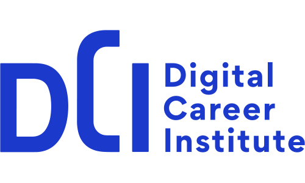
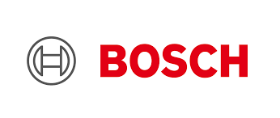
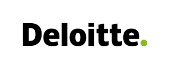

<h1 align="center">Sharanya Ganesh Prasad</h1>
<table>
  <tbody>
    <tr>
      <td><b>Information</b></td>
      <td width="20%" rowspan="4">
        
      </td>
    </tr>
    <tr>
      <td>
        <ul>
          <li>sharanyaganehsprasad@gmail.com / 
          sharanyaprasad95@gmail.com</li>
          <li><a href="./pages/links.md">Links</a></li>
        </ul>
      </td>
    </tr>
    <tr><td><b>Showcase</b></td></tr>
    <tr>
      <td width="50%">
        <ul>
          <li><a href="#education">Education</a></li>
          <li><a href="#experience">Experience</a></li>
          <li><a href="#skills">Skills & Qualifications</a></li>
        </ul>
      </td>
    </tr>
  </tbody>
</table>

<h1 id="education" align="center">Education</h1>
<table>

  <tr>
    <td width="80%">
      <b>Master of Science in Computer Science</b> 
      Graduated September 2022 
      University of Saarland - Saarbrucken Saarland, Germany 
      GPA: 2.6 
    </td>
    <td><image alt="SU" src="../assets/img/about/uni-logo.png" /></td>
  </tr>

  <tr>
    <td>
      <b>Bachelor of Science in Computer Science, </b>   
      Graduated August 2017 
      National institute of Engineering - Mysore, India 
      GPA: 9.15 
      6th Rank holder in the department 
    </td>
    <td><image alt="SU" src="../assets/img/about/nie.png" /></td>
  </tr>

  <tr>
    <td>
      <b>College and High School</b>  
      Graduated June 2013 
      Sadvidya PU college and High schoole - Mysore, India 
      PU : 90%  
      SSLC: 97.3 %  
    </td>
    <td><image alt="GFSD" src="../assets/img/about/sadvidya.png" /></td>
  </tr>
  
</table>

<h1 id = "experience" align="center">Experience</h1>

<table>
  <tr>
    <td width="80%">
      <h2>Digital Career Institute, Berlin, Germany</h3>
      <h3>AWS Solutions Architect & Cloud Practitioner Teacher  <i>(Jun 2024 – Present)</i> </h3> 
      As an AWS Solutions Architect and Cloud Practitioner instructor, I create and deliver targeted lessons to prepare students for AWS certification success. My curriculum aligns with the AWS Solutions Architect Associate (SAA) exam, focusing on essential AWS services like EC2, VPC, CloudFront, ELB, and Auto Scaling. I also prepare students for the AWS Cloud Practitioner exam by providing foundational training in cloud computing, covering infrastructure essentials such as storage, compute, networking, and database management. After completing the Cloud Practitioner training, I transition students to DevOps concepts that support their preparation for the SAA exam, fostering a comprehensive understanding of AWS. Teaching over 30 students so far, I emphasize practical experience with hands-on labs in CloudFormation and Terraform, guiding them in infrastructure as code (IaC) principles for efficient cloud resource automation and provisioning. Additionally, I lead deep dives into AWS networking, teaching students to design secure, scalable VPC architectures and equipping them with the strategies needed for certification success.
      <h3>DevOps Teacher</h3>  
      <i>Jun 2023 – Jun 2024</i>  
      In my role as a DevOps instructor, I taught more than 60 students through in-depth courses on core programming languages and frameworks, including Python, PostgreSQL, MongoDB, Django, and Flask. My approach emphasized practical skills in REST API development, Git-based version control, and end-to-end project development, preparing students for careers as Full Stack Developers. Through interactive lectures, live demonstrations, and hands-on coding exercises, I guided students in completing full-stack projects involving Docker, Linux, and cloud-based applications. I also introduced them to CI/CD automation with Jenkins and GitHub Actions, giving them the tools to build scalable deployment pipelines and bridging academic learning with real-world development skills. Additionally, I mentored students in job search strategies, helping them apply their skills confidently in the job market.
    </td>
    <td align="center"></td>
  </tr>

  
   <tr>
    <td width="80%">
      <h2>SAM-DIMENSION GmbH, Stuttgart, Germany</h3>
      <h3>Data Scientist  <i>(Jan 2023 – Apr 2023)</i> </h3>  
      At SAM-DIMENSION, I worked as a data scientist, focusing on acquiring and processing image data from drones to create clean and balanced datasets. I implemented data augmentation and cleaning techniques to improve data quality and completeness. Leveraging computer vision techniques, including Convolutional Neural Networks (CNNs) and transfer learning, I developed models for image classification and object detection to support analytical insights, contributing to the company’s data-driven solutions.
    </td>
    <td align="center"></td>
  </tr>
 <tr>
    <td width="80%">
      <h2>Robert Bosch GmbH, Homburg, Germany</h2>
      <h3>Master Thesis Project: Quality Prediction in Grinding Process  <i>(Jun 2021 – Sep 2022)</i> </h3>  
      As part of my master’s thesis at Bosch, I conducted a detailed evaluation of machine learning techniques for predicting product quality in manufacturing. I explored time-series data analysis, implementing parallelized feature extraction and training pipelines optimized for GPU processing. I also developed a Docker-based anomaly detection service and established a CI/CD pipeline in Azure DevOps, optimizing quality control processes through automation and efficiency.
      <h3> Artificial Intelligence Intern</h3>
      During my AI internship at Bosch, I worked closely with cross-functional teams to gather requirements and collaborated with the production team on-site to create a pipeline for quality detection in manufacturing. I conducted performance analysis on different neural network architectures for classification, enhancing the production monitoring system with advanced AI capabilities.
    </td>
    <td align="center"></td>
  </tr>

  <tr>
    <td width="80%">
      <h2>Deloitte Consulting India Pvt Ltd, Bengaluru, India</h2>
      <h3>Business Technology Analyst  <i>(Jan 2018 – Feb 2019)</i> </h3>  
     At Deloitte, I received technical training in ABAP and BODS, developing expertise in the SAP environment. I created custom business applications for reporting and smart form generation, providing tailored solutions that streamlined business processes and improved reporting efficiency.
    </td>
    <td align="center"></td>
  </tr>
</table>

<h1 id = "skills" align="center"> Skills & Qualifications </h1>

### Programming Languages
- C, C++, C#, Python, SQL, JavaScript, TypeScript, Java, F#

---

### Web Development & Frameworks
- Django, Flask, REST, React, HTML, CSS, JSON, XML, YAML

---

### Databases
- PostgreSQL, MongoDB, SQL, pymongo, psycopg2

---

### Software Development & DevOps
- Microservices (Docker), Docker-Compose, Docker Registry, Kubernetes, Version Control (Git), Jenkins, Clean Architecture, Linux, AWS CLI, Windows Subsystem for Linux (WSL), SAP, Putty

---

### Cloud & Infrastructure
- AWS (IaC, PaC, SaC), AWS Serverless, Terraform, CloudFormation

---

### CI/CD & Automation
- Jenkins, GitHub Actions, Docker, Postman

---

### Data Science & Machine Learning
- Time-Series Analysis, Natural Language Processing (NLP), Image Processing, Statistics, Regression, Naive Bayes, Dimensionality Reduction, Support Vector Machines (SVM), Convolutional Neural Networks (CNN), Recurrent Neural Networks (RNN), Long Short-Term Memory (LSTM), Generative Adversarial Networks (GAN)

---

### Libraries & Frameworks
- Pandas, NumPy, Matplotlib, SciPy, Scikit-learn, OpenCV, Keras, TensorFlow, PyTorch

---

### Development Tools
- JetBrains IDEs, Visual Studio, Git, GitHub

---

### Principles
- Agile, Scrum, Kanban, Software as a Service (SaaS), Object-Oriented Design

---

### Soft Skills
- Communication, Collaboration, Adaptability, Problem-Solving, Critical Thinking

---

<!-- ---
# the default layout is 'page'
icon: fas fa-info-circle
order: 4
---

# About Me

<h1 align="center">Hi 👋, I'm Sharanya Ganesh Prasad</h1>
<h3 align="center">Software Developer</h3>

- 🔭 I’m currently working as **Cloud Engineer Educationer**

- 👨‍💻 All of my projects are available at [https://sharanyagprasad.github.io/](https://sharanyagprasad.github.io/)

- 📝 I regularly write articles on [https://sharanyagprasad.github.io/](https://sharanyagprasad.github.io/)

- 💬 Ask me about **Django, Database, linux,**

- 📫 How to reach me **sharanyaganeshprasad@gmail.com**

<h3 align="left">Connect with me:</h3>

 -->
