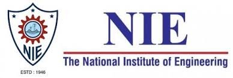
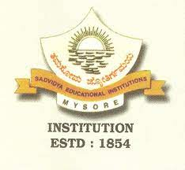

---
# the default layout is 'page'
icon: fas fa-info-circle
order: 4
---

<!-- [Back to main page](./../README.md) -->
<html lang="en">
<head>
  <meta charset="UTF-8">
  <meta name="viewport" content="width=device-width, initial-scale=1.0">
  <title>Education</title>
  
</head>
<body>
  

    

      
      

        <b>Master of Science in Computer Science</b>
        
Graduated September 2022

        
University of Saarland - Saarbrucken Saarland, Germany

        
GPA: 2.6

      

    

  

      
      

        <b>Bachelor of Science in Computer Science</b>
        
Graduated August 2017

        
National Institute of Engineering - Mysore, India

        
GPA: 9.15

        
6th Rank holder in the department

      

    

  

      
      

        <b>College and High School</b>
        
Graduated June 2013

        
Sadvidya PU College and High School - Mysore, India

        
PU: 90%

        
SSLC: 97.3%

      

    

  

</body>
</html>